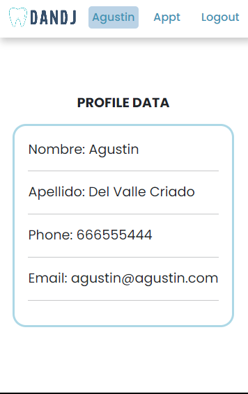

# Clinica Dental Front End React

Este proyecto consiste en una página web front end conectada a una API backend con Base de Datos para la gestión de una clinica dental.

### Instalación:
* Clonar el repositorio: git clone https://github.com/jordijerico/ClinicaDentalFrontEnd
* Instalar las dependencias: npm install
* Iniciar el servidor de desarrollo: npm run dev

### Descripción breve de cómo usar el proyecto.

Navegar a la url en el navegador.
* Hacer clic en el botón "Iniciar sesión".
* Introducir las credenciales de usuario.
* Explorar las diferentes secciones de la aplicación.

### Características

1. Registro de clientes en la aplicación

2. Login de usuarios en la aplicación como doctor/cliente/admin

3. Consulta de datos del perfil

4. Consulta de citas existentes

5. Creación de nuevas citas

### Tecnologías utilizadas
* React
* HTML
* CSS
* JavaScript

### Contribución
Si deseas contribuir a este proyecto, sigue los siguientes pasos:

1. Haz un fork del repositorio.
2. Crea una rama con tus cambios: git checkout -b mi-rama.
3. Haz tus cambios y haz commit: git commit -m "mis cambios".
4. Haz push a la rama: git push origin mi-rama.
5. Crea un pull request en el repositorio original.
### Créditos
Autor: Jordi Jericó López
Contacto: jordijerico@gmail.com  /  https://github.com/jordijerico

### Licencia
Este proyecto está bajo la licencia MIT. Consulta el archivo LICENSE para más detalles.